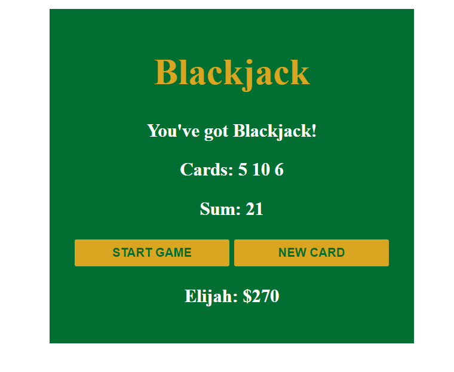

# BlackJack Game

## Description



> You have two cards face up in front of your bet. To play your hand, first you add the card values together and get a hand total anywhere from 4 to 21.  Aces count as 1 or 11, and face cards (Jack, Queen & King) as 10.

>> This is part of the [**Scrimba Front-End Career Path**](https://scrimba.com/learn/frontend) projects

## Built With

- HTML
- CSS
- JavaScript

## Get Started

To get a local copy up and running follow these simple example steps.

1. Clone the Repo or Download the Zip file or ``` https://github.com/ElijahTobs/BlackJack-Game.git ```.
2. ``` cd /BlackJack-Game ```
3. Open it with the live server

## Test

For tracking linter errors locally you need to follow these steps:

After cloning the project you need to run these commands

``` npm install ```  
`` This command will download all the dependancies of the project ``

For tracking linter errors in HTML file, run:

``` npx hint index.html ```

For tracking linter errors in CSS or SASS file, run:

``` npx stylelint "\*_/_.{css,scss}" ```

And For tracking linter errors in JavaScript file, run:

``` npx eslint index.js ```

## Live Demo

See the live by clicking [Live Demo Link](https://elijah-blackjack-game.netlify.app/)

## Author

👤 **Elijah Ayandokun**

- GitHub: [@ElijahTobs](https://github.com/ElijahTobs)
- Twitter: [@ElijahTobs](https://twitter.com/elijahDevinci)
- LinkedIn: [Elijah Ayandokun](https://www.linkedin.com/in/elijahayandokun/)

## 🤝 Contributing

Contributions, issues, and feature requests are welcome!

Feel free to check the [issues page](https://github.com/ElijahTobs/BlackJack-Game/issues/).

## Show your support

Give a ⭐️ if you like this project!

## Acknowledgments

- Thanks to everyone who will get time to check this code and sugest any [issue](https://github.com/ElijahTobs/BlackJack-Game/issues) to improve the page.
- Thank you [Scrimba](https://www.scrimba.com/)

## 📝 License

This project is [MIT](./MIT.md) licensed.
